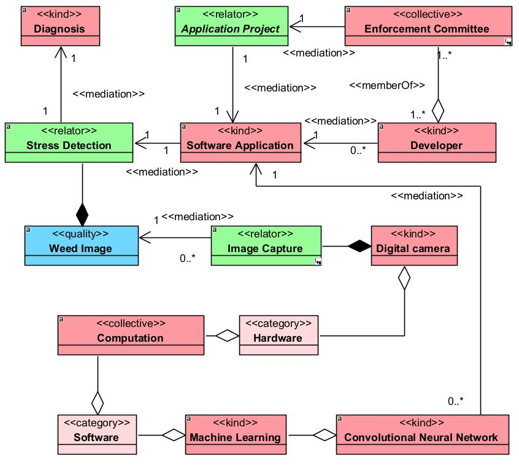
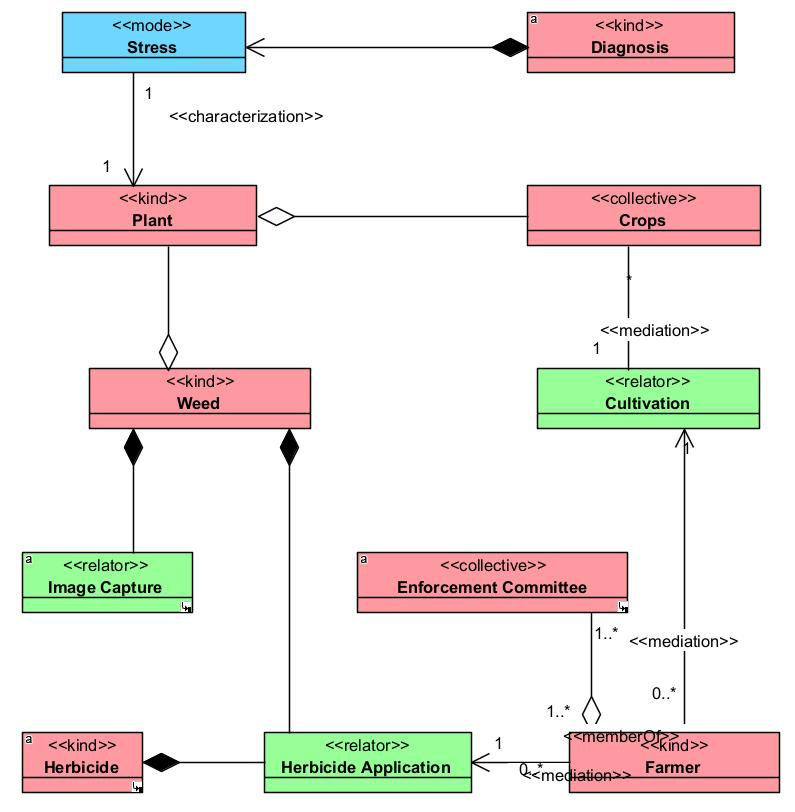
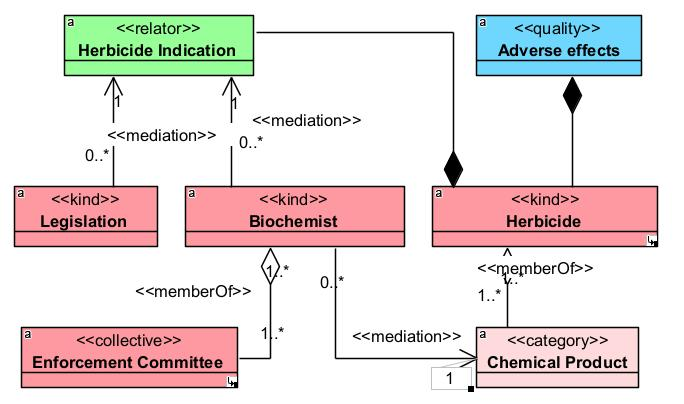

# Documentação da Ontologia

## 1. Introdução

A Ontologia para o Desenvolvimento de um Sistema de Detecção de Efeitos de Herbicidas em Plantas (ORDSH) é uma representação estruturada e abrangente do conhecimento relacionado à identificação de efeitos de herbicidas em plantas daninhas. Esta documentação fornece uma compreensão detalhada da ontologia, incluindo seu propósito, estrutura e como ela pode ser utilizada.

## 2. Objetivo

A principal finalidade da ORDSH é representar de forma precisa e integrada os conceitos e relações envolvidos no processo de identificação de efeitos de herbicidas em plantas daninhas. A ontologia visa apoiar pesquisadores, produtores agrícolas, desenvolvedores e bioquímicos, proporcionando um ambiente unificado para a compreensão e análise dos dados relacionados a esse contexto.

## 3. Estrutura da Ontologia

A ORDSH é organizada em três visões distintas, cada uma focando em um domínio específico: Computação, Agricultura e Bioquímica.

### 3.1 Visão de Computação

Esta visão abrange conceitos relacionados a sistemas computacionais, processamento de imagem, aprendizado de máquina e dados de treinamento. Destaca as tecnologias, algoritmos e configurações específicas usadas na identificação de efeitos de herbicidas.

### 3.2 Visão de Agricultura

Concentrando-se em conceitos ligados a herbicidas, plantas daninhas, imagens de plantas daninhas, efeitos de herbicidas e ações no campo agrícola, esta visão reflete a interação prática da ontologia nos processos agrícolas.

### 3.3 Visão de Bioquímica

Esta visão aborda conceitos mais específicos relacionados às propriedades bioquímicas dos herbicidas, caracterizando suas fórmulas químicas, concentrações e efeitos nas plantas daninhas em um nível molecular.

## 4. Ontologia Operacional

A construção da ontologia foi realizada na plataforma Protégé Community, uma ferramenta de modelagem ontológica de código aberto. A estrutura da ontologia inclui classes, propriedades, restrições e relações que juntas proporcionam uma representação robusta do domínio em questão.

## 5. Utilizando a Ontologia

Para utilizar a ORDSH em um projeto ou pesquisa, siga estes passos:

1. **Download do Repositório:**
   - Clone o repositório da ontologia: `git clone https://github.com/leandrogrego/WeedEye`

2. **Exploração dos Arquivos:**
   - Navegue até o diretório `ontology` para acessar os arquivos OWL da ontologia.

3. **Integração com Ferramentas:**
   - Utilize ferramentas compatíveis com OWL, como o Protégé, para visualizar e interagir com a ontologia.

4. **Contribuições e Customizações:**
   - Caso deseje contribuir ou customizar a ontologia, faça alterações de acordo com as necessidades específicas do seu projeto.

## 6. Contribuições

Contribuições para a melhoria e expansão da ORDSH são bem-vindas. Se você identificar problemas, tiver sugestões ou quiser colaborar, abra uma issue ou envie uma solicitação de pull.

## 7. Licença

A ORDSH é licenciada sob a Licença MIT. Consulte o arquivo [LICENSE](LICENSE) para obter detalhes.

## 8. Elementos Gráficos

Para uma compreensão mais visual da ontologia, consulte as figuras abaixo:

### 8.1 Visão de Computação

[Inserir Figura 1: Diagrama de Visão de Domínio Computação]

### 8.2 Visão de Agricultura

### 8.3 Visão de Bioquímica

[Inserir Figura 3: Diagrama de Visão de Domínio Bioquímica]

Esta documentação oferece uma visão geral da ontologia e orientações básicas para sua utilização. Certifique-se de consultar a estrutura detalhada nos arquivos OWL para uma compreensão completa dos conceitos e relações presentes na ontologia.